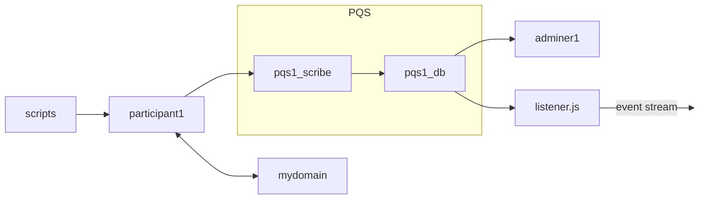

# PQS Postgres Notify Listen demo

Each demo is in its own Git branch.

## Purpose

This demo shows how to use Postgres' NOTIFY/LISTEN mechanism.
The demo happens to use PQS as a source of changes
within a Postgres instance.
To be clear, this is not a demo of PQS functionality but
of a Postgres feature.




## References

[All the Ways to Capture Changes in Postgres](https://blog.sequin.io/all-the-ways-to-capture-changes-in-postgres/) is an excellent blog post on the subject.

[PQS Simple Docker Compose demo](https://github.com/wallacekelly-da/daml-public-demos/tree/pqs-simple-docker-compose) explains more about the PQS aspects of this demo.

## Sample Commands

Checkout the demo:

```
git clone https://github.com/wallacekelly-da/daml-public-demos.git --branch pqs-postgres-notify-listen --single-branch pqs-postgres-notify-listen
```

Get the required images:

```
docker login digitalasset-docker.jfrog.io

docker compose pull
```

Check that node is installed:

```
> node --version
v16.20.2
```

Run the demo:

```
# start the Canton components
daml build
docker compose up --detach pqs1_scribe

# wait for pqs1_scribe to warm up, then
docker compose up setup

# start the Javascript listener
node install
node listener.js

# create contracts on the ledger
docker compose up contracts
docker compose up contracts
docker compose up contracts

# observe the listener responding
# to changes on the ledger

# cleanup
docker compose down
```

## Additional Commands

Open a `psql` console to Postgres.

```
docker run -it --rm --network pqs-postgres-notify-listen_default --volume ./:/host/ postgres:16 psql --host=pqs1_db --username=postgres --dbname=postgres
```

```
postgres=# \dt

               List of relations
 Schema |       Name        | Type  |  Owner
--------+-------------------+-------+----------
 public | Accept.123dj3po   | table | postgres
 public | Archive.11wnvoab  | table | postgres
 public | Bid.20ini8        | table | postgres
 public | BidRequest.sbovf0 | table | postgres
 public | PaintHouse.kcam2p | table | postgres
 public | Propose.x0zrvu    | table | postgres
 public | _archives         | table | postgres
 public | _creates          | table | postgres
 public | _creates_mappings | table | postgres
 public | _exercises        | table | postgres
 public | _mappings         | table | postgres
 public | _reassignments    | table | postgres
 public | _transactions     | table | postgres
 public | _watermark        | table | postgres
```

```
postgres=# select payload->'acceptedBid'->'amount' as amount from "PaintHouse.kcam2p";

      amount
-------------------
 "1000.0000000000"
(1 row)
```
