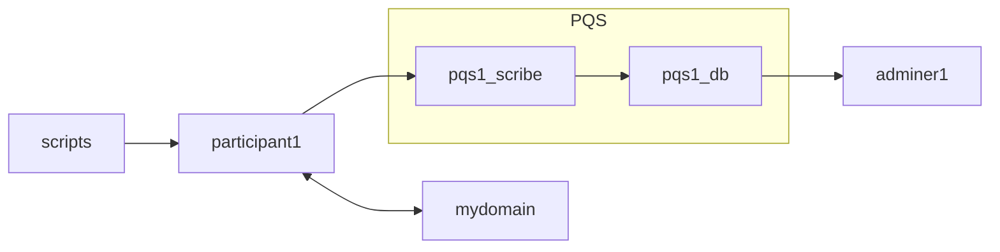

# Daml Public Demos by Wallace Kelly

Each demo is in its own Git branch.

## Purpose

This demo gets a minimal instance of PQS up-and-running.
This demo is for initial investigation of PQS -- not a full production configuration.



## Sample Commands

Checkout the demo:

```
git clone https://github.com/wallacekelly-da/daml-public-demos.git --branch pqs-simple-docker-compose --single-branch pqs-simple-docker-compose
```

Get the required images:

```
docker login digitalasset-docker.jfrog.io

docker compose pull
```

Run the demo:

```
daml build

docker compose up pqs1_scribe --detach

# wait for services to be up-and-running

docker compose up adminer1 --detach

# explore the database (http://localhost:8080/)

docker compose up scripts

docker compose down
```


## Additional Commands

Open a `psql` console to the PQS.

```
docker run -it --rm --network pqs-simple-docker-compose_default  --volume ./:/host/ postgres:16 psql --host=pqs1_db --username=postgres postgres
```

```
postgres=# \dt
               List of relations
 Schema |           Name           |       Type        |  Owner   
--------+--------------------------+-------------------+----------
 public | __contract_implements    | table             | postgres
 public | __contract_tpe           | table             | postgres
 public | __contracts              | partitioned table | postgres
 public | __contracts_1            | table             | postgres
 public | __contracts_2            | table             | postgres
 public | __contracts_3            | table             | postgres
 public | __events                 | table             | postgres
 public | __exercise_tpe           | table             | postgres
 public | __exercises              | partitioned table | postgres
 public | __exercises_1            | table             | postgres
 public | __exercises_2            | table             | postgres
 public | __exercises_3            | table             | postgres
 public | __packages               | table             | postgres
 public | __tmp_archived_contracts | table             | postgres
 public | __transactions           | table             | postgres
 public | __watermark              | table             | postgres
 public | flyway_schema_history    | table             | postgres

postgres=# select payload->'acceptedBid'->'amount' as amount from "active"('PaintHouse');

      amount
-------------------
 "1000.0000000000"
(1 row)
```
