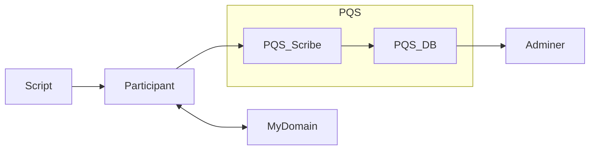

# Daml Public Demos by Wallace Kelly

Each demo is in its own Git branch.

## Purpose

This demo gets a minimal instance of PQS up-and-running.
This demo is for initial investigation of PQS -- not a full production configuration.



## Sample Commands

Checkout the demo:

```
git clone https://github.com/wallacekelly-da/daml-public-demos.git --branch pqs-simple-docker-compose --single-branch pqs-simple-docker-compose
```

Get the required images:

```
docker login digitalasset-docker.jfrog.io

docker pull digitalasset-docker.jfrog.io/canton-enterprise:2.7.6

docker pull digitalasset-docker.jfrog.io/participant-query-store:0.1.0
```

Run the demo:

```
daml build

docker compose up pqs1_scribe --detach

# wait for services to be up-and-running

docker compose up adminer1 --detach

# explore the database (http://localhost:8080/)

docker compose up scripts

docker compose down
```