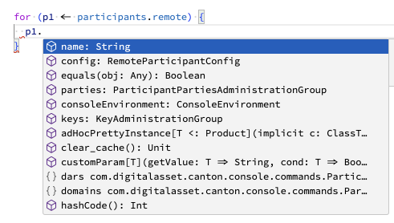

# Daml Public Demos by Wallace Kelly

Each demo is in its own Git branch.

## Background

It would be nice to have Intellisense in Visual Code when writing a [Canton Console script](https://docs.daml.com/2.6.5/canton/usermanual/console.html).



Canton Console scripts are used for bootstrapping
and other administrative tasks on Canton nodes.
The scripts are written in Scala and run
within an Ammonite environment.

*Disclaimer*: I have no idea what I'm doing.
These notes are based on trial and error.
Maybe someone else will write a better guide and I can delete this one.

## Setup

I'm using Visual Studio Code 1.87.2 on Mac OS.

1. **Install** the [Scala (Metals) VS Code Extension](https://marketplace.visualstudio.com/items?itemName=scalameta.metals) into Visual Studio Code. I'm using version 1.29.0.
1. **Download** a Canton jar file into a folder named `lib`. For example, [this one](https://github.com/digital-asset/canton/releases/tag/v2.8.3).
1. **Create** these two files:
   ```scala
   // pingAll.sc
   //
   import $cp.lib.`canton-open-source-2.8.3.jar`
   import $file.cantonEnv, cantonEnv._

   import com.digitalasset.canton.logging.NamedLoggerFactory
   import com.typesafe.scalalogging.Logger

   val loggerFactory = consoleEnvironment.environment.loggerFactory
   val logger = Logger("pingAll")

   for (p1 <- participants.remote) {
      for (p2 <- participants.remote) {
         logger.info("Pinging " + p2.id + " from " + p1.id)
         p1.health.ping(p2.id)
      }
   }
   ```
   ```scala
   // cantonEnv.sc
   //
   import $cp.lib.`canton-open-source-2.8.3.jar`

   import com.digitalasset.canton.console.*

   val consoleEnvironment: ConsoleEnvironment = null

   val participants: NodeReferences[
      ParticipantReference,
      RemoteParticipantReference,
      LocalParticipantReference
   ] = null
   ```
1. **Open** `pingAll.sc`,  
   **press** `Cmd-Shift P`,  
   **select** "Metals: Start Ammonite Build Server", and  
   **monitor** the build server status in Visual Studio Code's Output window, Metals task.
   Mine looks like this:
   ```
   INFO  tracing is disabled for protocol BSP, to enable tracing of incoming and outgoing JSON messages create an empty file at /Users/wallacekelly/dev/wallacekelly-da/daml-public-demos/.metals/bsp.trace.json or /Users/wallacekelly/Library/Caches/org.scalameta.metals/bsp.trace.json
   INFO  Ammonite: Starting BSP server
   INFO  Connected to Ammonite Build server v3.0.0-M0-60-89836cd8
   INFO  Required scalafmt dialect rewrite to 'scala3'. Directories:
   - pingAll.sc
   - cantonEnv.sc
   WARN  Ammonite does not support `buildTarget/jvmRunEnvironment`, unable to fetch run environment.
   INFO  time: indexed workspace in 4.67s
   INFO  compiling cantonenv.sc
   INFO  time: compiled cantonEnv.sc in 2.36s
   INFO  compiling pingall.sc
   INFO  time: compiled pingAll.sc in 527μs
   WARN  Ammonite does not support `buildTarget/jvmRunEnvironment`, unable to fetch run environment.
   ```
1. **Mouseover** `p1` in the editor for `pingAll.sc`. Does the tooltip `RemoteParticipantReference` appear? It does for me.
1. **Type** `p1.` in the inner for loop of `pingAll.sc`. Does the list of methods on a `RemoteParticipantReference` appear? It does for me.
1. **Add** some of the files to your `.gitignore` file.
   * the `lib` folder
   * the `.ammonite` folder
   * the `.metals` folder
   * the `.scalafmt.conf` file
   * all the `*.sc` files

## Development cycle

1. **Create** a `*.sc` file with the following header:
   ```
   import $cp.lib.`canton-open-source-2.8.3.jar`
   import $file.cantonEnv, cantonEnv._
   ```
1. **Compose** the script within a `*.sc` file (e.g., `pingAll.sc`) with the advantages of Intellisense.
1. **Copy-and-paste** the code into a `*.canton` file (e.g., `pingAll.canton`) for use as a Canton Console script.
   In the `*.canton` file, do not include the imports of the Canton JAR or the `cantonEnv.sc` file.

## Notes

1. Yes, it's a hack. But it is better than writing the scripts without Intellisense.
1. In my experimentation, I made regular use of `Ctrl-Shift P`, "Developer: Reload Window"
   and `Ctrl-Shift P`, "Metals: Start/Stop Ammonite build server". YMMV.
1. The `cantonEnv.sc` file needs to grow to include
   all the instances that are injected into the Canton Console environment.
   Currently, it just includes those needed for this demo.
1. I cannot find a way to tell the Scala (Metals) extension to treat
   `*.canton` files as Ammonite script files.
   However, that seems OK, since we don't want the header import statements to be included in the `*.canton` files.
1. In the editor for `pingAll.sc`, the variable `logger` is underlined as an error with the message:
   "Scala 2 macro cannot be used in Dotty...  To turn this error into a warning, pass -Xignore-scala2-macros to the compiler."
   I cannot figure out how to do that.