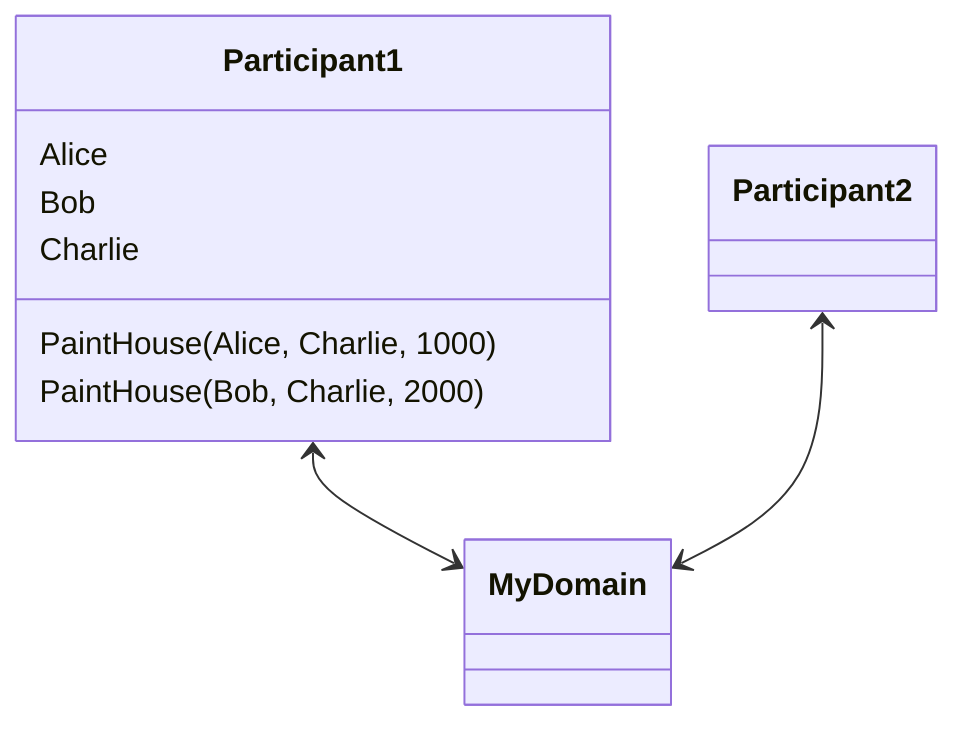
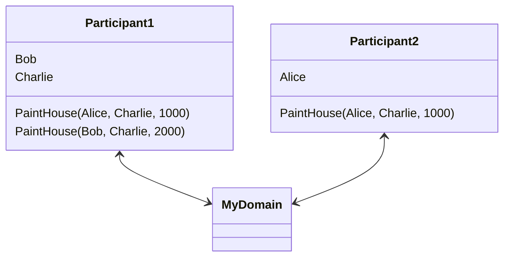

# Daml Public Demos by Wallace Kelly

Each demo is in its own Git branch.

## Summary

In this demo, I perform a single migration of a single party
and its contracts from one participant node to another.

### Before



### After



This demo relies on the [repair macros in Daml 2.8.3](https://docs.daml.com/2.8.3/canton/usermanual/identity_management.html#replicate-party-to-another-participant-node).

## Sample Commands

1. **Checkout** this branch.

```
git clone https://github.com/wallacekelly-da/daml-public-demos.git --branch migrating-parties --single-branch migrating-parties

cd migrating-parties
```

---

2. **Launch** all the services.

```
docker compose down; daml build; docker compose up contracts
```

Output:

```
Attaching to contracts
contracts  | Slf4jLogger started
contracts  | [DA.Internal.Prelude:557]: Charlie to paint Alice's house
contracts  | [DA.Internal.Prelude:557]: Charlie to paint Bob's house
contracts  | Running CoordinatedShutdown with reason [ActorSystemTerminateReason]
contracts exited with code 0
```

---

3. **Peek** in the ledger with Navigator.

```
docker compose up --detach navigator1 navigator2
```

---

4. **Peek** in participant1 with daml script.

```
daml script --dar .daml/dist/demo-0.0.1.dar --ledger-host localhost --ledger-port 5003 --script-name LedgerState:listContracts
```

Output:

```
alice sees: charlie painting for alice
bob sees: charlie painting for bob
charlie sees: charlie painting for alice
charlie sees: charlie painting for bob
```

5. **Peek** in participant2 with daml script.

```
daml script --dar .daml/dist/demo-0.0.1.dar --ledger-host localhost --ledger-port 5005 --script-name LedgerState:listContracts
```

Output:

```
```

---

6. **Migrate** Alice using the [configs/migrate.canton](./configs/migrate.canton) file.

```
docker compose up migrate
```

Output:

```
 Found party alice on participant participant1.
 Performing set_max_rate_per_participant.
 After configuration changes, wait for participant and mediator timeout (one minute).
 Beginning step1_store_acs.
 party-migration / step 1: downloading acs for alice::1220fb6a1b84....
 Disconnecting participant2.
 Beginning step2_import_acs.
 party-migration / step 2: import acs for alice::1220fb6a1b84... from /canton/host/configs/alice.acs.gz
 Beginning step3_delegate_party_to_target_node.
 party-migration / step 3: delegate alice::1220fb6a1b84... to PAR::participant2::122085c33001...
 Adding From party to participant tx for alice::1220fb6a1b84... -> PAR::participant2::122085c33001...
 Reconnecting participant2.
 Beginning step4_enable_party_on_target.
 party-migration / step 4: enable alice::1220fb6a1b84... on PAR::participant2::122085c33001...
 Beginning step5_remove_party_delegation_from_source.
 party-migration / step 5: remove alice::1220fb6a1b84... from PAR::participant1::1220fb6a1b84...
 Removing PartyToParticipant(Both, alice::1220fb6a1b84..., PAR::participant1::1220fb6a1b84..., Submission) from authorized store
 Disconnecting participant1.
 Beginning step6_cleanup_source.
 party-migration / step 6: cleanup contracts in /canton/host/configs/alice.acs.gz from PAR::participant1::1220fb6a1b84...
 Reconnecting participant1.
```

---

7. **Peek** in participant1 with daml script.

```
daml script --dar .daml/dist/demo-0.0.1.dar --ledger-host localhost --ledger-port 5003 --script-name LedgerState:listContracts
```

Output:

```
 bob sees: charlie painting for bob
 charlie sees: charlie painting for bob
```

8. **Peek** in participant2 with daml script.

```
daml script --dar .daml/dist/demo-0.0.1.dar --ledger-host localhost --ledger-port 5005 --script-name LedgerState:listContracts
```

Output:

```
 alice sees: charlie painting for alice
```

---

9. **Create** more contracts after migrating Alice.

```
docker compose up setup; docker compose up contracts
```

Output:

```
Charlie to paint Alice's house
Charlie to paint Bob's house
```

---

10. **Peek** in participant1 with daml script.

```
daml script --dar .daml/dist/demo-0.0.1.dar --ledger-host localhost --ledger-port 5003 --script-name LedgerState:listContracts
```

Output:

```
 alice sees: charlie painting for alice
 bob sees: charlie painting for bob
 bob sees: charlie painting for bob
 charlie sees: charlie painting for bob
 charlie sees: charlie painting for alice
 charlie sees: charlie painting for bob
```

11. **Peek** in participant2 with daml script.

```
daml script --dar .daml/dist/demo-0.0.1.dar --ledger-host localhost --ledger-port 5005 --script-name LedgerState:listContracts
```

Output:

```
alice sees: charlie painting for alice
alice sees: charlie painting for alice
```

---

**Shutdown** the demo.

```
docker compose down
```

## Anomalies

After the migration...

1. `daml ledger list-parties` always shows Alice as a local party on participant1, even if she is "offboarded."
2. The original, migrated contract between Alice and Charlie is no longer visible to Charlie.
