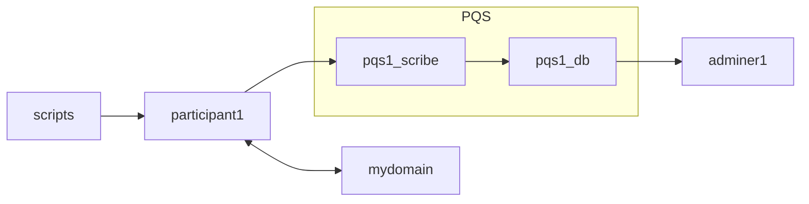

# Daml Public Demos by Wallace Kelly

Each demo is in its own Git branch.

## Purpose

This demo gets a minimal instance of PQS up-and-running.
This demo is for initial investigation of PQS -- not a full production configuration.



## Sample Commands

Checkout the demo:

```
git clone https://github.com/wallacekelly-da/daml-public-demos.git --branch pqs-simple-docker-compose --single-branch pqs-simple-docker-compose
```

Get the required images:

```
docker login digitalasset-docker.jfrog.io

docker compose pull
```

Run the demo:

```
daml build

docker compose up pqs1_scribe --detach

# wait for services to be up-and-running

docker compose up adminer1 --detach

# explore the database (http://localhost:8080/)

docker compose up scripts

docker compose down
```

## Additional Commands

Open a `psql` console to the PQS.

```
docker run -it --rm --network pqs-simple-docker-compose_default postgres:16 psql --host=pqs1_db --username=postgres postgres
```

```
postgres=# \dt
               List of relations
 Schema |       Name        | Type  |  Owner
--------+-------------------+-------+----------
 public | Accept.123dj3po   | table | postgres
 public | Archive.11wnvoab  | table | postgres
 public | Bid.20ini8        | table | postgres
 public | BidRequest.sbovf0 | table | postgres
 public | PaintHouse.kcam2p | table | postgres
 public | Propose.x0zrvu    | table | postgres
 public | _archives         | table | postgres
 public | _creates          | table | postgres
 public | _creates_mappings | table | postgres
 public | _exercises        | table | postgres
 public | _mappings         | table | postgres
 public | _reassignments    | table | postgres
 public | _transactions     | table | postgres
 public | _watermark        | table | postgres

postgres=# select payload->'acceptedBid'->'amount' as amount from "PaintHouse.kcam2p";

      amount
-------------------
 "1000.0000000000"
(1 row)
```
