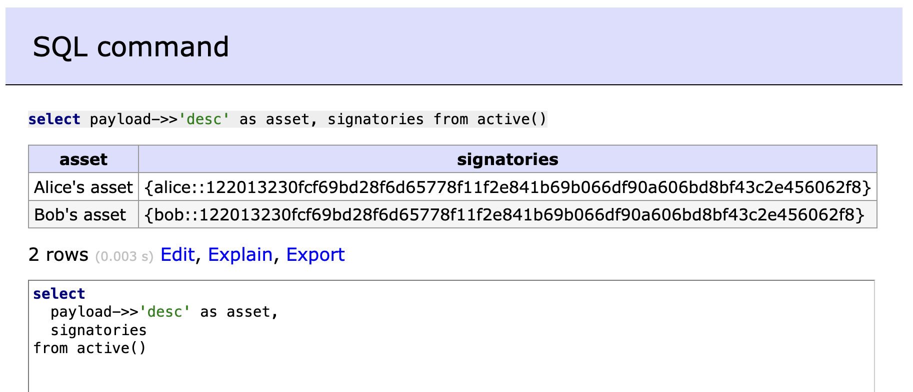

# Daml Public Demos by Wallace Kelly

Each demo is in its own Git branch.

## Purpose

This demo gets a minimal instance of PQS up-and-running.
This demo is for initial investigation of PQS -- not a full production configuration.


## Sample Commands

Checkout the demo:

```
git clone https://github.com/wallacekelly-da/daml-public-demos.git --branch pqs-simple-docker-compose --single-branch pqs-simple-docker-compose
```

Get the required images:

```
docker login digitalasset-docker.jfrog.io

docker compose pull
```

Run the demo:

```
daml build

docker compose up pqs1_scribe --detach

# wait for services to be up-and-running

docker compose up adminer1 --detach

# explore the database (http://localhost:8080/)

docker compose up scripts

# run the database functions, e.g., active()

docker compose down
```

## Adminer Screenshots





## Additional Commands

Open a `psql` console to the PQS.

```
docker run -it --rm \
  --network pqs-simple-docker-compose_default \
  --volume ./:/host/ \
  postgres:16 psql \
  --host=pqs1_db \
  --username=postgres
```

```
select
  payload->'acceptedBid'->'request'->'painter' as painter,
  payload->'acceptedBid'->'amount' as amount
from active('demo:Main:PaintHouse');

                                   painter                                   |     bidamount
-----------------------------------------------------------------------------+-------------------
 "bob::12202091b729aa5575bc96922be699379b92881cdb233d1942adc5847672093d07d6" | "1000.0000000000"
(1 row)
```

```
postgres=# \x on
postgres=# \df

     :
     :
-[ RECORD 23 ]------+----------------------------------------------------------------------------------------------------------------
Schema              | public
Name                | active
Result data type    | SETOF contract
Argument data types | qname text DEFAULT NULL::text, at_offset text DEFAULT latest_offset()
Type                | func
-[ RECORD 24 ]------+----------------------------------------------------------------------------------------------------------------
Schema              | public
Name                | archives
Result data type    | SETOF contract
Argument data types | qname text DEFAULT NULL::text, from_offset text DEFAULT oldest_offset(), to_offset text DEFAULT latest_offset()
Type                | func
     :
     :

postgres=# \x off
postgres=# \quit
```
