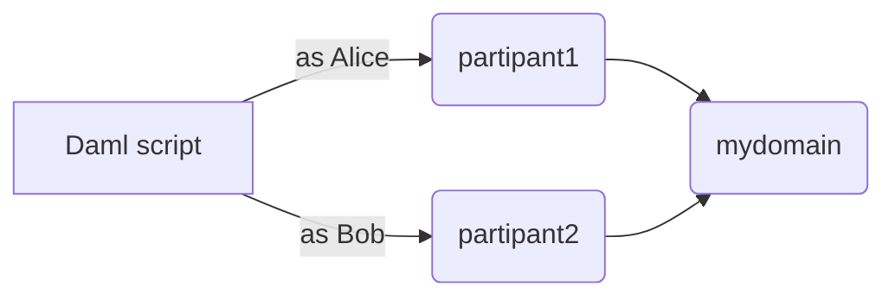

# Daml Public Demos by Wallace Kelly

Each demo is in its own Git branch.

## Summary

In this demo, I show how to run a single Daml script
such that it can submit _as different parties_
against _multiple participant nodes_.



I do this with:

* the `--participant-config` parameter available to `daml script`
* the `utils.generate_daml_script_participant_config()` Canton function
* the `listKnownPartiesOn` Daml Script function

## Sample Commands

Checkout this branch.

```
git clone https://github.com/wallacekelly-da/daml-public-demos.git --branch daml-script-participant-config --single-branch daml-script-participant-config

cd daml-script-participant-config
```

Run these commands:

```
daml build

docker compose up --detach mydomain participant1 participant2

rm -f configs/participant-config.json

docker compose up utils

cat configs/participant-config.json

docker compose up scripts

daml navigator server localhost 5003 --port 4000 --feature-user-management false

daml navigator server localhost 5005 --port 4001 --feature-user-management false

docker compose down
```

## Sample Output

```sh
> docker compose up --detach mydomain participant1 participant2

[+] Running 4/4
 ✔ Network daml-public-demos_default  Created
 ✔ Container mydomain                 Started
 ✔ Container participant2             Started
 ✔ Container participant1             Started
```

```sh
> docker compose up utils

[+] Running 4/0
 ✔ Container mydomain      Running
 ✔ Container participant2  Running
 ✔ Container participant1  Running
 ✔ Container utils         Created
Attaching to utils
utils exited with code 0
```

```sh
> cat configs/participant-config.json

{
  "default_participant" : {
    "host" : "participant1",
    "port" : 5003
  },
  "participants" : {
    "participant1" : {
      "host" : "participant1",
      "port" : 5003
    },
    "participant2" : {
      "host" : "participant2",
      "port" : 5005
    }
  },
  "party_participants" : {
    "participant1::122005..." : "participant1",
    "participant2::122006..." : "participant2",
    "alice::122005..." : "participant1",
    "bob::122006..." : "participant2"
  }
}
```

```sh
> docker compose up scripts

[+] Running 2/0
 ✔ Container scripts created
Attaching to scripts
scripts  | [DA.Internal.Prelude:557]: \"Alice creating a bid request...\"
scripts  | [DA.Internal.Prelude:557]: \"Bob submitting a proposal...\"
scripts  | [DA.Internal.Prelude:557]: \"Waiting for a cid (10 retries)...\"
scripts  | [DA.Internal.Prelude:557]: \"Waiting for a cid (9 retries)...\"
scripts  | [DA.Internal.Prelude:557]: \"Waiting for a cid (8 retries)...\"
scripts  | [DA.Internal.Prelude:557]: \"Alice accepting the proposal...\"
scripts  | Scripts:happy_path SUCCESS
scripts exited with code 0
```