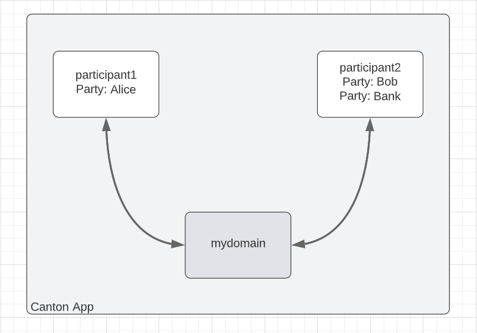
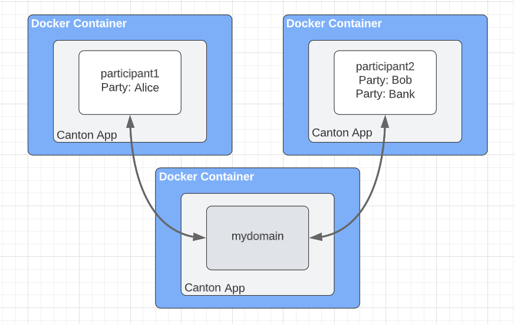
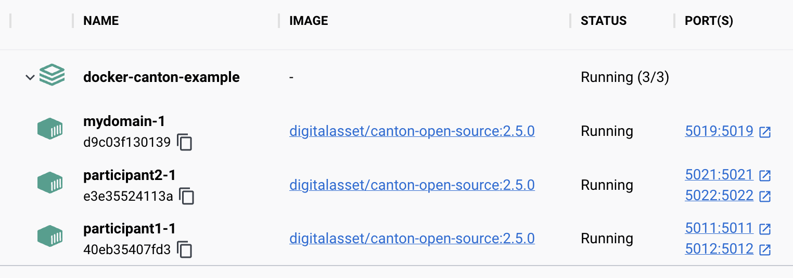

# CantonExample with Docker Compose

## Background

The Canton documentation includes [a Canton Getting Started example]() with the following topology.



Notice that the two participants and the domain are running in the same Canton instance. Also notice that the Canton instance is running directly on the host computer.

While working through that example I wondered, "What would it take to setup this example within three Docker containers launched with Docker Compose?" Here is that same example with each participant running in its own container:



This article shows what I did to set that up. This is strictly for experimentation on your local machine, not for production purposes.

## Launch the containers

1. Create three configuration files (one for each of the Canton applications.)

   * Use `0.0.0.0` for the address binding (to play nicely with the Docker networking)

   * <details> <summary>mydomain.conf</summary>  

      ```
      canton {
        domains {
          mydomain {
            storage.type = memory
            public-api.port = 5018
            public-api.address = 0.0.0.0
            admin-api.port = 5019
            admin-api.address = 0.0.0.0
          }
        }
      }
      ```
      </details>

   * <details> <summary>participant1.conf</summary>  

      ```
      canton {
        participants {
          participant1 {
            storage.type = memory
            admin-api.port = 5012
            admin-api.address = 0.0.0.0
            ledger-api.port = 5011
            ledger-api.address = 0.0.0.0
          }
        }
      }
      ```
      </details>

   * <details> <summary>participant2.conf</summary>  

      ```
      canton {
        participants {
          participant2 {
            storage.type = memory
            admin-api.port = 5022
            admin-api.address = 0.0.0.0
            ledger-api.port = 5021
            ledger-api.address = 0.0.0.0
          }
        }
      }
      ```
      </details>

1. Create two bootstrap files (one for each of the Canton participants.)
   * Connect the participants to the domain.
   * Upload the DAR (which is already included in the Canton Open Source image.)
   * Enable the parties for the participants.
   * Generate a Navigator configuration file (for our convenience when later launching Navigator.)

   * <details><summary>participant1.canton</summary>
     
     ```
      nodes.local.start()
      participant1.domains.connect("mydomain", "http://mydomain:5018")
      participant1.dars.upload("dars/CantonExamples.dar")
      participant1.parties.enable("Alice", waitForDomain=DomainChoice.All)
      utils.generate_navigator_conf(participant1, Some("./host/ui-backend-participant1.conf"))
     ```
    </details>

   * <details><summary>participant2.canton</summary>
     
     ```
      nodes.local.start()
      participant2.domains.connect("mydomain", "http://mydomain:5018")
      participant2.dars.upload("dars/CantonExamples.dar")
      participant2.parties.enable("Bob", waitForDomain=DomainChoice.All)
      participant2.parties.enable("Bank", waitForDomain=DomainChoice.All)
      utils.generate_navigator_conf(participant2, Some("./host/ui-backend-participant2.conf"))
     ```
    </details>

1. Create a docker-compose.yaml file.
   * Use the `digitalasset/canton-open-source` image.
   * Make the local folder available within the container (so that we can conveniently provide configuration files to the container.)
   * Launch the Canton service in daemon mode, using the appropriate configuration and bootstrap file for each node.
   * Expose the various ports (so that the containers can communicate with each other.)
   * Publish the Admin and Ledger API ports to the host (so that we can connect with a Canton Console and Navigator.)

   * <details><summary>docker-compose.yaml</summary>

      ```
      services: 

        mydomain:
          image: digitalasset/canton-open-source:2.5.0
          volumes:
            - ./:/canton/host/:rw
          entrypoint: bin/canton
          command: daemon --config "host/mydomain.conf" --log-profile container
          expose:
            - 5018
            - 5019
          ports:
            - 5018:5018
            - 5019:5019

        participant1:
          image: digitalasset/canton-open-source:2.5.0
          volumes:
            - ./:/canton/host/:rw
          entrypoint: bin/canton
          command: daemon --config "host/participant1.conf" --bootstrap "host/participant1.canton" --log-profile container
          expose:
            - 5011
            - 5012
          ports:
            - 5011:5011
            - 5012:5012

        participant2:
          image: digitalasset/canton-open-source:2.5.0
          volumes:
            - ./:/canton/host/:rw
          entrypoint: bin/canton
          command: daemon --config "host/participant2.conf" --bootstrap "host/participant2.canton" --log-profile container
          expose:
            - 5021
            - 5022
          ports:
            - 5021:5021
            - 5022:5022
      ```

      </details>

1. Launch Docker Desktop and run `docker compose up --detach`.



## Connect with Canton Console

1. Create a remote.conf file for the three nodes.

   * <details><summary>remote.conf</summary>

      ```
        canton {
          remote-domains {
            mydomain {
              admin-api {
                address = "localhost"
                port = "5019"
              }
              public-api {
                address = "localhost"
                port = "5018"
              }
            }
          }
          remote-participants {
            participant1 {
              admin-api {
                address = "localhost"
                port = "5012"
              }
              ledger-api {
                address = "localhost"
                port = "5011"
              }
            }
            participant2 {
              admin-api {
                address = "localhost"
                port = "5022"
              }
              ledger-api {
                address = "localhost"
                port = "5021"
              }
            }
          }
        }
      ```
      </details>

1. Start the Canton Console, with `daml canton-console -c remote.conf`.
1. Test the connectivity with `participant1.health.ping(participant2)`.
1. Confirm the parties were created with `participant1.parties.list("Bob")`.

## Connect with Navigator

TODO
