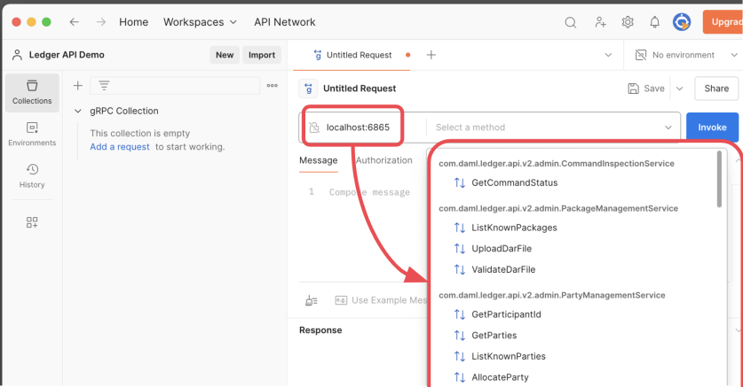
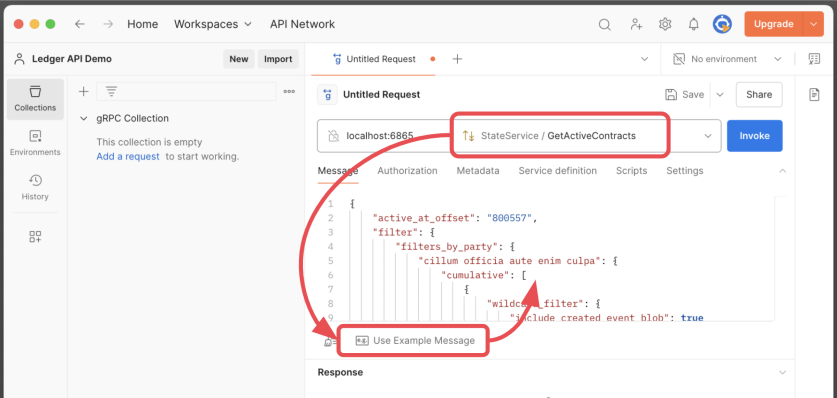
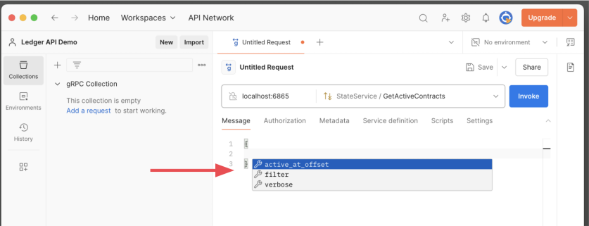
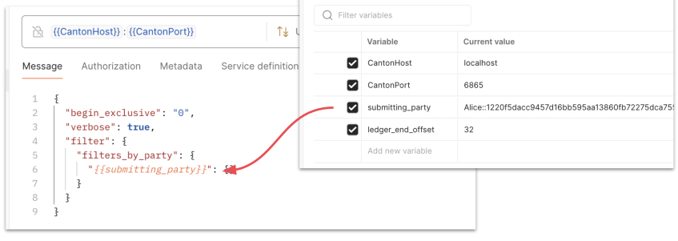
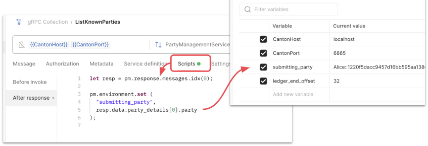

# gRPC and Postman Demo

Shows how to use `grpcurl` and Postman to interact with the Ledger API.

## Setup

Create a skeleton Daml project.

   ```
   daml new ledger-api-demo

   cd ledger-api-demo

   daml start
   ```

## Explore the Ledger API with reflection

Using `grpcurl`:

```
grpcurl -plaintext localhost:6865 list

grpcurl -plaintext localhost:6865 list \
   com.daml.ledger.api.v2.StateService

grpcurl -plaintext localhost:6865 describe \
   com.daml.ledger.api.v2.StateService.GetActiveContracts

grpcurl -plaintext localhost:6865 describe \
   com.daml.ledger.api.v2.GetActiveContractsRequest
```

Using Postman:




## Form gRPC messages

Rely heavily on [the docs](https://docs.daml.com/app-dev/grpc/proto-docs.html).

Use Postman's "Use Sample Message" feature



Use Postman's Intellisense-like editing:



In Postman, inject a value into a request:



In Postman, extract a value from a response:



## Sample requests and responses

### List known parties

Command

```
grpcurl --plaintext localhost:6865 \
  com.daml.ledger.api.v2.admin.PartyManagementService.ListKnownParties 
```

Response

```
{
  "party_details": [
    {
      "party": "Alice::1220f5...",
      "is_local": true,
      "local_metadata": {
        "resource_version": "0"
      }
    }

      :
      :

  ]
}
```

### Get ledger end

Command

```
grpcurl --plaintext localhost:6865 \
  com.daml.ledger.api.v2.StateService.GetLedgerEnd 
```

Response

```
{
  "offset": "32"
}
```

### Get active contracts

Request

```
{
  "active_at_offset": "32",
  "filter": {
    "filters_for_any_party": {}
  },
  "verbose": true
}
```

Command

```
cat GetActiveContracts.json | \
  grpcurl --plaintext -d @ localhost:6865 \
  com.daml.ledger.api.v2.StateService.GetActiveContracts
```

Response

```
{
  "active_contract": {
    "created_event": {
      "event_id": "#122…81e5:1",
      "contract_id": "00e23f7…ef5",
      "template_id": { … },
      "create_arguments": {
        "recordId": { … },
        "fields": [
          {
            "label": "issuer",
            "value": {
              "party": "Alice::1220f5da…5f20f"
            }
          },
       :
       :
```

### Get updates

Request

```
{
  "begin_exclusive": "0",
  "filter": {
    "filters_for_any_party": {}
  },
  "verbose": true
}
```

Command

```
cat GetUpdates.json | \
  grpcurl --plaintext -d @ localhost:6865 \
  com.daml.ledger.api.v2.UpdateService.GetUpdates
```

Response

```
{
  "transaction": {
    "update_id": "1220cc…699dd",
    "command_id": "f2b41f…6262f",
    "effective_at": "2025-01-21T14:01:32.269651Z",
    "events": [
      {
        "created": {
          "event_id": "#1220ccba4a…99dd:0",
          "contract_id": "0000f…289d4a0",
          "template_id": { … },
          "create_arguments": {
            "recordId": { … },
            "fields": [
              {
                "label": "issuer",
                "value": {
                  "party": "Alice::1220f5…975f20f"
                }
              },
```