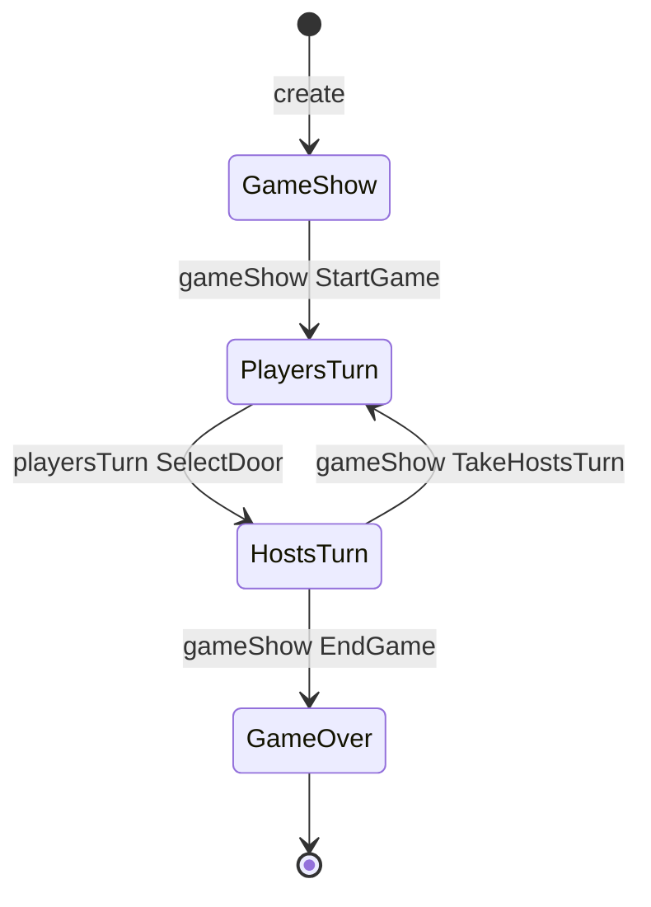
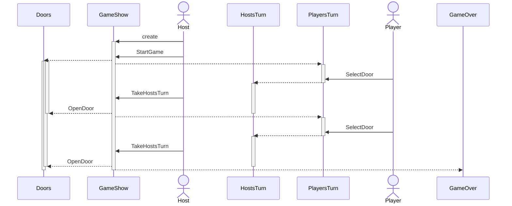
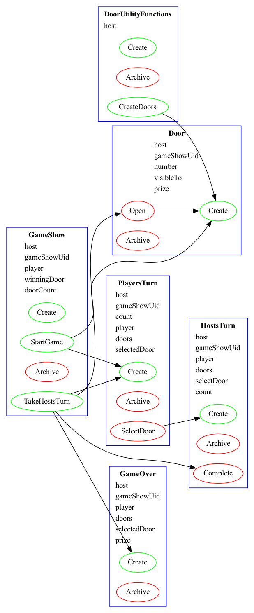

# Monty Hall

## Mermaid State Diagram

```mermaid
stateDiagram-v2
    [*] --> GameShow: create
    GameShow --> PlayersTurn: gameShow StartGame
    PlayersTurn --> HostsTurn: playersTurn SelectDoor
    HostsTurn --> PlayersTurn: gameShow TakeHostsTurn
    HostsTurn --> GameOver: gameShow EndGame
    GameOver --> [*]
```

```mermaid
sequenceDiagram
    participant Doors
    participant GameShow
    actor Host
    participant HostsTurn
    participant PlayersTurn
    actor Player
    participant GameOver
    Host->>+GameShow: create
    Host->>GameShow: StartGame
    GameShow-->>Doors: 
    activate Doors
    activate Doors
    activate Doors
    GameShow-->>+PlayersTurn: 
    Player->>PlayersTurn: SelectDoor
    PlayersTurn-->>-HostsTurn: 
    activate HostsTurn
    Host->>GameShow: TakeHostsTurn
    GameShow-->>Doors: OpenDoor
    deactivate Doors
    deactivate HostsTurn
    GameShow-->>+PlayersTurn: 
    Player->>PlayersTurn: SelectDoor
    PlayersTurn-->>-HostsTurn: 
    activate HostsTurn
    Host->>GameShow: TakeHostsTurn
    GameShow-->>Doors: OpenDoor
    deactivate Doors
    deactivate HostsTurn
    GameShow-->>-GameOver: 
    activate GameShow
    deactivate Doors
```

## visual-web visualization

[Here](visual-web.html)

## graphviz visualization

